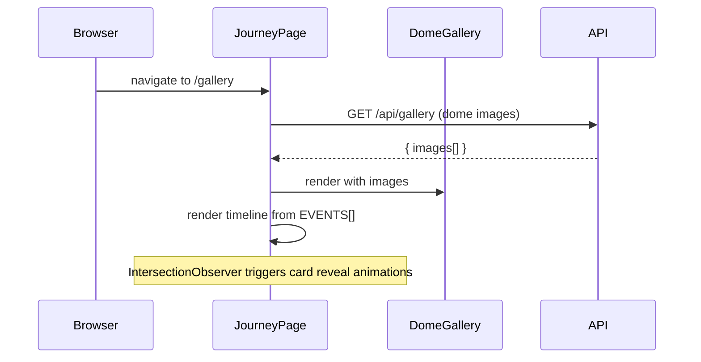
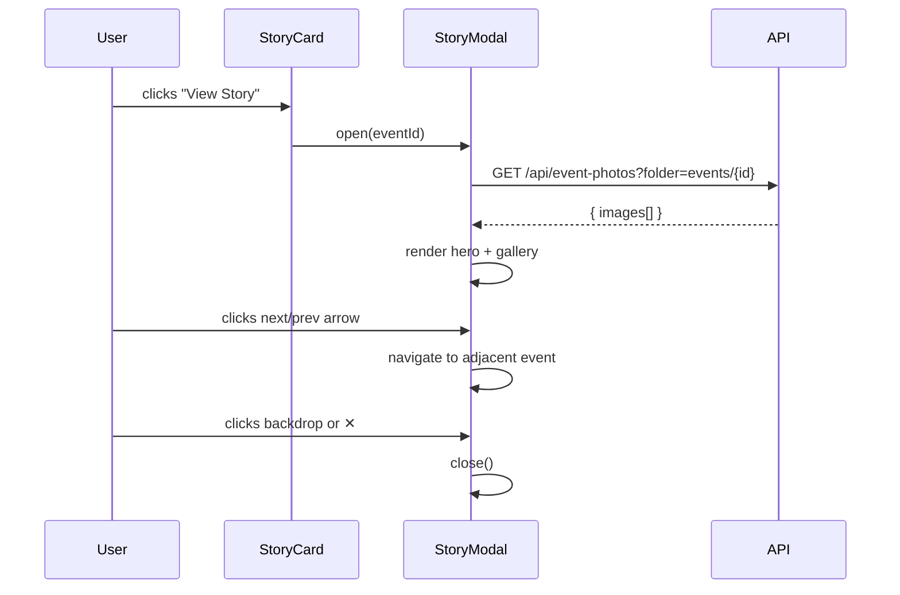

# Design Document: Journey Section

## Overview

The Gallery section is completely redesigned into a premium "Journey" section — a chronological, interactive timeline of 7 key events in the developer's life as an engineer, leader, and learner. Each event becomes a rich story card with a full-screen modal for deep-dive storytelling. The DomeGallery 3D sphere is retained at the top as the visual centrepiece; the event grid below is replaced with a timeline layout grouped by year.

The route stays at `/gallery` (no redirect required) but the entire UI, data, and copy are replaced.

---

## Architecture

```mermaid
graph TD
    A[/gallery route - JourneyPage] --> B[DomeGallery 3D Sphere]
    A --> C[JourneyTimeline]
    C --> D[YearGroup 2023]
    C --> E[YearGroup 2024]
    C --> F[YearGroup 2025]
    C --> G[YearGroup 2026]
    D & E & F & G --> H[StoryCard]
    H -->|View Story click| I[StoryModal]
    I --> J[HeroImage + parallax]
    I --> K[EventOverview / Role / Story]
    I --> L[Highlights + Lessons Learned]
    I --> M[PhotoLightbox - multi-image]
    I --> N[Technologies / Tags]
    I --> O[Optional Quote]
    I --> P[Estimated Impact]
    I --> Q[Prev / Next navigation]
    H -->|photos API| R[/api/event-photos?folder=events/id]
    R --> S[public/events/event-id/]
```

---

## Sequence Diagrams

### Page Load



### View Story Flow



---

## Components and Interfaces

### JourneyPage (replaces GalleryPage)

**File**: `src/app/gallery/page.tsx`

**Purpose**: Root page component. Fetches dome images, renders the sphere hero and the timeline.

**Interface**:
```typescript
export default function JourneyPage(): JSX.Element
```

**Responsibilities**:
- Fetch `/api/gallery` for DomeGallery images
- Render DomeGallery with existing props
- Render `<JourneyTimeline events={EVENTS} />`
- Pass modal open/close state to children via callbacks or local state

---

### JourneyTimeline

**Purpose**: Groups events by year and renders them with timeline connectors and scroll-reveal animations.

**Interface**:
```typescript
interface JourneyTimelineProps {
  events: EventEntry[];
  onViewStory: (eventId: string) => void;
}
function JourneyTimeline(props: JourneyTimelineProps): JSX.Element
```

**Responsibilities**:
- Group `EVENTS` by `year` in ascending order (2023 → 2024 → 2025 → 2026)
- Render a `<YearGroup>` for each year
- Render timeline connectors (vertical line) between groups

---

### YearGroup

**Purpose**: Renders a year heading and the event cards for that year.

**Interface**:
```typescript
interface YearGroupProps {
  year: string;
  events: EventEntry[];
  onViewStory: (eventId: string) => void;
}
function YearGroup(props: YearGroupProps): JSX.Element
```

**Responsibilities**:
- Render the year label with lime accent styling
- Render `<StoryCard>` for each event in the group
- Expose `data-year` attribute for IntersectionObserver targeting

---

### StoryCard

**Purpose**: Interactive card for a single event. Shows cover image, year/month, title, location, role, short description, tags, and "View Story" button.

**Interface**:
```typescript
interface StoryCardProps {
  event: EventEntry;
  index: number;                     // for staggered animation delay
  onViewStory: (id: string) => void;
}
function StoryCard(props: StoryCardProps): JSX.Element
```

**Responsibilities**:
- Fetch cover photo from `/api/event-photos?folder=events/{event.id}` (first image used as cover)
- Reveal via IntersectionObserver (fade + slide up)
- Hover: card elevation + cover image zoom
- Render floating tags with staggered animation
- "View Story" button triggers `onViewStory(event.id)`

---

### StoryModal

**Purpose**: Full-screen story modal for a single event. Includes hero image, all story content, photo gallery lightbox, and prev/next navigation.

**Interface**:
```typescript
interface StoryModalProps {
  events: EventEntry[];             // full sorted list for prev/next
  activeId: string | null;
  onClose: () => void;
}
function StoryModal(props: StoryModalProps): JSX.Element | null
```

**Responsibilities**:
- Open/close with CSS transition (opacity + scale)
- Fetch all photos for the active event from the API
- Hero image with CSS parallax effect on scroll
- Render: overview, role, story, highlights, lessons learned, technologies, optional quote, estimated impact
- Inline photo lightbox (prev/next thumbnails strip)
- Keyboard: `Escape` closes, `ArrowLeft/Right` navigates prev/next event
- Prev/Next event navigation buttons
- Body scroll lock while open (`overflow: hidden` on `document.body`)

---

### PhotoLightbox (within StoryModal)

**Purpose**: Inline multi-photo gallery within the modal with thumbnail strip and full-size view.

**Interface**:
```typescript
interface PhotoLightboxProps {
  photos: EventPhoto[];
  activeIndex: number;
  onPrev: () => void;
  onNext: () => void;
  onGoTo: (i: number) => void;
}
function PhotoLightbox(props: PhotoLightboxProps): JSX.Element
```

---

## Data Models

### EventEntry (extended)

The existing `EventEntry` type in `experience-data.ts` needs two new optional fields to support the richer story modal content.

```typescript
export type EventEntry = {
  id: string;
  title: string;
  date: string;          // "Mar 2025"
  year: string;          // "2025"
  month?: string;        // "March" — for display in card header
  location: string;
  summary: string;       // short description shown on card
  description: string;   // full story shown in modal
  role?: string;
  highlights: string[];
  lessonsLearned?: string[];     // NEW — for modal "Lessons Learned" section
  technologies?: string[];       // NEW — explicit tech list for modal
  quote?: string;                // NEW — optional pull quote
  estimatedImpact?: string;      // NEW — impact summary sentence
  imageIds?: string[];
  photoFolder?: string;          // "events/{id}"
  tags: string[];
  website?: string;
};
```

### EventPhoto

```typescript
type EventPhoto = {
  src: string;
  alt: string;
};
```

### YearGroup (runtime type)

```typescript
type YearGroup = {
  year: string;
  events: EventEntry[];
};
```

---

## EVENTS Data (7 entries, corrected per spec)

The `EVENTS` array in `experience-data.ts` is replaced with these 7 canonical entries (sorted chronologically):

| # | id | title | year | date | location | role |
|---|----|-------|------|------|----------|------|
| 1 | `incridea-2023` | Incridea 2023 | 2023 | 2023 | NMAMIT, Nitte | Publicity Committee Member |
| 2 | `incridea-2024` | Incridea 2024 | 2024 | Mar 2024 | NMAMIT, Nitte | Publicity Committee Member |
| 3 | `ethglobal-delhi` | ETHGlobal Delhi | 2025 | 2025 | New Delhi, India | Blockchain Developer |
| 4 | `incridea-2025` | Incridea 2025 | 2025 | Mar 2025 | NMAMIT, Nitte | Publicity Committee Member |
| 5 | `pizza-connections` | Pizza & Connections | 2026 | 2026 | NMAMIT, Nitte | Host & Organizer |
| 6 | `blockchain-club-inauguration` | Guest Speaker – Blockchain Club Inauguration | 2026 | 2026 | S-VYASA University | Guest Speaker |
| 7 | `ethmumbai-2026` | ETHMumbai 2026 | 2026 | Mar 2026 | Mumbai, India | Full-Stack Product Engineer |

Each entry has `photoFolder: "events/{id}"` and appropriate `highlights`, `lessonsLearned`, `technologies`, `tags`.

---

## Animation Specifications

| Animation | Trigger | Implementation |
|-----------|---------|----------------|
| Timeline card reveal | Scroll into viewport | IntersectionObserver → add `.is-visible` class → CSS `opacity` + `translateY` transition |
| Card hover elevation | `:hover` | CSS `translateY(-6px)` + `box-shadow` |
| Card cover image zoom | `:hover` on cover | CSS `transform: scale(1.06)` on `img` inside `.story-card-cover` |
| Modal open | State change | CSS `opacity: 0 → 1` + `scale(0.97 → 1)` with 250ms ease |
| Modal close | State change | Reverse transition before `display: none` |
| Fade-in text in modal | Modal open | Staggered `animationDelay` on text blocks |
| Floating tags | Card render | CSS `@keyframes floatTag` — subtle vertical oscillation |
| Hero parallax | Modal scroll | `onScroll` listener → `transform: translateY(scrollY * 0.3)` on hero image |
| Year heading reveal | Scroll into viewport | IntersectionObserver → same `.is-visible` pattern |

---

## Error Handling

### Error Scenario 1: No photos for event

**Condition**: API returns empty `images[]` for an event's photo folder.
**Response**: StoryCard renders without cover image (placeholder gradient shown). "View Story" button still works.
**Recovery**: Modal opens and skips the photo gallery section if `photos.length === 0`.

### Error Scenario 2: Photo API fetch failure

**Condition**: `/api/event-photos` throws or returns non-200.
**Response**: `catch(() => {})` silently ignores. Photos stay empty.
**Recovery**: UI degrades gracefully — no broken images shown.

### Error Scenario 3: Modal opened with invalid event ID

**Condition**: `activeId` passed to `StoryModal` doesn't match any entry in `events`.
**Response**: Modal renders `null` (returns early).
**Recovery**: `onClose()` is called automatically if `activeId` is stale after data update.

### Error Scenario 4: Dome gallery fetch failure

**Condition**: `/api/gallery` returns error or empty array.
**Response**: DomeGallery renders with `DEFAULT_IMAGES` fallback (existing behaviour).
**Recovery**: No user-visible error — sphere still renders.

---

## Testing Strategy

### Unit Testing Approach

- Test `groupEventsByYear()` utility: given an unsorted `EventEntry[]`, output should be `YearGroup[]` sorted ascending by year with correct event counts per group.
- Test `getAdjacentEvents()` utility: given `events[]` and `activeId`, return correct `prevId` and `nextId` (with null at boundaries).
- Test `EventEntry` type guards: verify optional fields default correctly.

### Property-Based Testing Approach

**Library**: fast-check

- **Grouping property**: For any array of `EventEntry` with arbitrary years, every event appears in exactly one `YearGroup`, no event is lost or duplicated.
- **Navigation property**: `getAdjacentEvents(events, id).nextId` on the last event is always `null`; `prevId` on the first event is always `null`.

### Integration Testing Approach

- Render `JourneyTimeline` with mock `EVENTS` data and assert correct year headings and card counts appear in the DOM.
- Open `StoryModal` with a mock event and assert hero image, highlights, tags, and prev/next buttons render correctly.
- Test modal keyboard navigation: fire `ArrowLeft`/`ArrowRight` key events and assert active event changes.

---

## Performance Considerations

- Photos are fetched lazily — `StoryCard` fetches its cover on mount; `StoryModal` fetches all photos only when opened.
- IntersectionObserver is disconnected after all cards become visible to avoid continuous observation.
- Images use `loading="lazy"` and `decoding="async"` attributes.
- Modal is rendered in a React portal (`document.body`) to avoid stacking context issues with the timeline.
- The DomeGallery is already code-split as a client component; no additional changes needed.

---

## Security Considerations

- The `/api/event-photos` route already sanitizes the `folder` parameter (strips `..` and non-alphanumeric chars). No changes needed.
- All event data is static and locally sourced — no user input is rendered as HTML.
- Modal closes on backdrop click and `Escape` to prevent focus trapping.

---

## Dependencies

All dependencies already present in the project:

| Dependency | Use |
|------------|-----|
| `next` / `react` | Framework and rendering |
| `@use-gesture/react` | Already used by DomeGallery |
| Existing CSS vars (`--color-bg`, `--card-bg`, `--card-border`, `var(--font-header)`) | Design tokens |
| `/api/event-photos` route | Photo serving (already implemented) |
| `/api/gallery` route | Dome sphere images (already implemented) |
| `src/components/portfolio/experience-data.ts` | Event data source |

No new npm packages are required.
